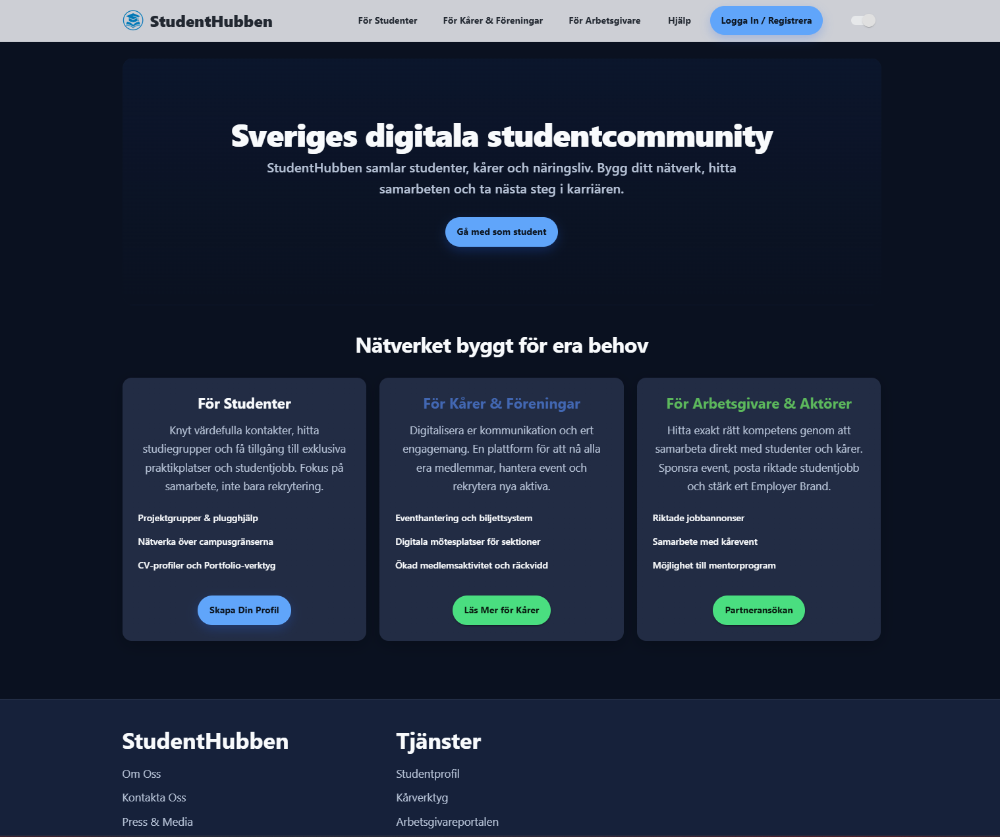
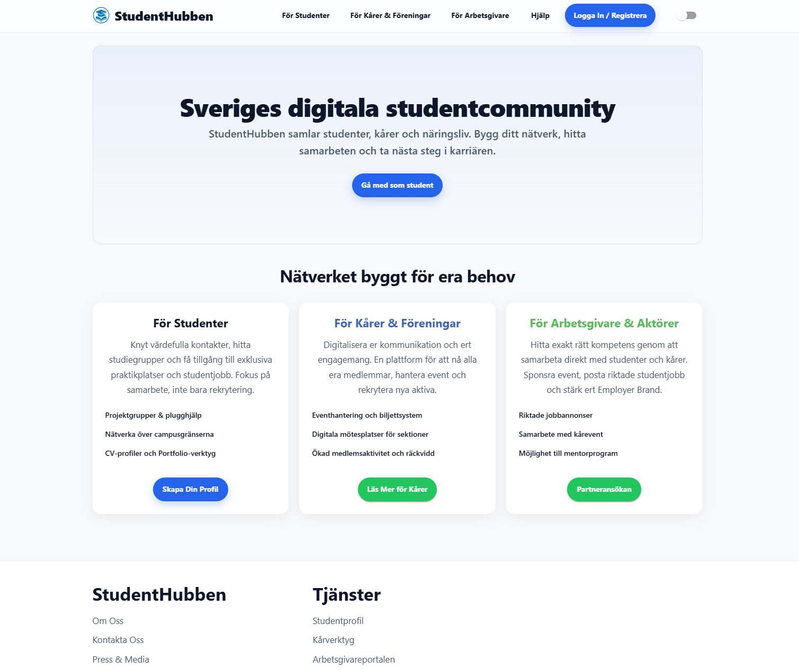
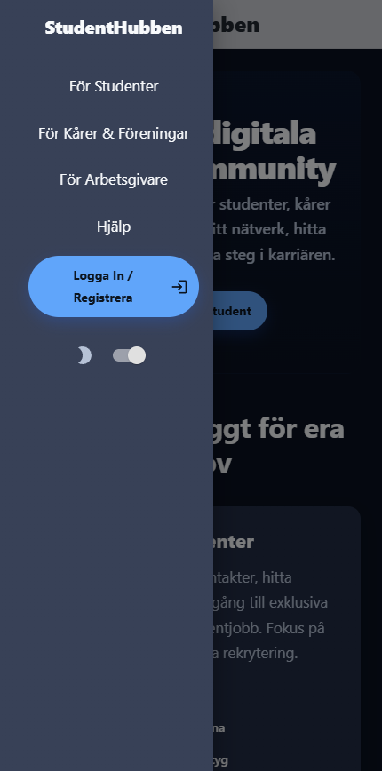
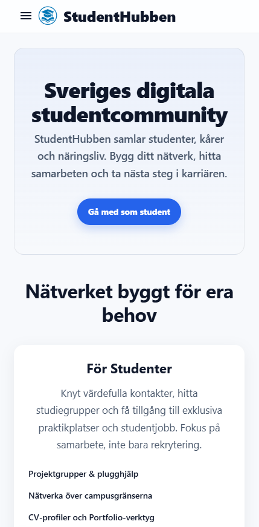

# StudentHubben Mockup

StudentHubben är en modern digital plattform för Sveriges studentvärld. Denna mockup är byggd med Next.js, React och Material UI, och visar hur ett framtida studentcommunity kan se ut – med fokus på nätverk, samarbete och tillgänglighet för studenter, kårer och arbetsgivare.

## Funktioner

- **Responsiv design:** Anpassad för både mobil och desktop.
- **Ljust och mörkt tema:** Användare kan enkelt växla mellan ljus och mörk visning.
- **Modern UI:** Färgstark, studentvänlig och tilltalande layout med MUI och egen theme.
- **Navigering:** Tydlig header med meny, login-knapp och temaväxling.
- **Footer:** Informativ och stilren footer med länkar och kontaktinformation.
- **Demo-sidor:** Exempel på startsida och komponenter för olika målgrupper.

## Teknik

- [Next.js](https://nextjs.org/) – React-baserad ramverk för moderna webbappar
- [React](https://react.dev/) – Komponentbaserat UI
- [Material UI (MUI)](https://mui.com/) – UI-komponenter och theming
- [TypeScript](https://www.typescriptlang.org/) – Typning och robust kod

## Kom igång

1. **Kloning:**
   ```bash
   git clone https://github.com/YOUR-USERNAME/mockup-student-site.git
   cd mockup-student-site
   ```
2. **Installera beroenden:**
   ```bash
   npm install
   ```
3. **Starta utvecklingsserver:**
   ```bash
   npm run dev
   ```
4. **Öppna i webbläsaren:**
   Gå till [http://localhost:3000](http://localhost:3000)

## Struktur

```
mockup-student-site/
├── src/
│   ├── app/
│   │   ├── layout.tsx
│   │   ├── page.tsx
│   │   └── globals.css
│   ├── components/
│   │   ├── Header.tsx
│   │   ├── Footer.tsx
│   │   └── ThemeRegistry.tsx
│   └── theme/
│       └── theme.ts
├── public/
│   └── studenthubben-logga.png
├── package.json
├── tsconfig.json
└── README.md
```

## Designidé

StudentHubben är tänkt som en samlingsplats för studenter, kårer och arbetsgivare. Fokus ligger på:
- **Nätverkande och samarbete**
- **Enkel onboarding och tydlig navigation**
- **Tillgänglighet och modern design**

## Skärmdumpar

| Desktop Dark | Desktop Light |
|:---:|:---:|
|  |  |

| Mobilmeny Dark | Mobilmeny Light |
|:---:|:---:|
|  |  |

## Kontakt

Utvecklad av [Josefine Eriksson](https://kodochdesign.se)

---

> Detta är en mockup/prototyp och inte en produktionssatt tjänst. Syftet är att visa design.
