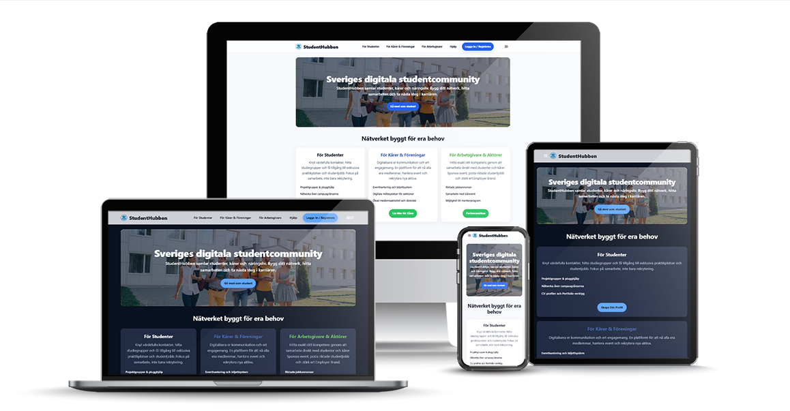

# 🎓 StudentHubben – Mockup

**StudentHubben** är en modern digital plattform för Sveriges studentvärld.  
Denna mockup är byggd med **Next.js**, **React** och **Material UI**, och illustrerar hur ett framtida studentcommunity kan se ut – med fokus på **nätverkande**, **samarbete** och **tillgänglighet** för **studenter**, **kårer** och **arbetsgivare**.

## 

## 🚀 Funktioner

- **Responsiv design** – Anpassad för både mobil och desktop
- **Ljust & mörkt tema** – Växla enkelt mellan ljus och mörk visning
- **Modern UI** – Färgstark, studentvänlig layout med MUI och egen theme
- **Tydlig navigering** – Header med meny, login-knapp och temaväxling
- **Informativ footer** – Stilren footer med länkar och kontaktinfo
- **Demo-sidor** – Exempel på startsida och komponenter för olika målgrupper

---

## 🧩 Teknikstack

| Teknologi                                     | Beskrivning                                 |
| --------------------------------------------- | ------------------------------------------- |
| [Next.js](https://nextjs.org/)                | React-baserat ramverk för moderna webbappar |
| [React](https://react.dev/)                   | Komponentbaserat UI-bibliotek               |
| [Material UI (MUI)](https://mui.com/)         | UI-komponenter och temahantering            |
| [TypeScript](https://www.typescriptlang.org/) | Typning och robust kodstruktur              |

---

## 🛠️ Kom igång

1. **Kloning**

   ```bash
   git clone https://github.com/YOUR-USERNAME/mockup-student-site.git
   cd mockup-student-site
   ```

2. **Installera beroenden**

   ```bash
   npm install
   ```

3. **Starta utvecklingsserver**

   ```bash
   npm run dev
   ```

4. **Öppna i webbläsaren**
   [http://localhost:3000](http://localhost:3000)

---

## 📁 Projektstruktur

```bash
mockup-student-site/
├── src/
│   ├── app/
│   │   ├── layout.tsx
│   │   ├── page.tsx
│   │   └── globals.css
│   ├── components/
│   │   ├── Header.tsx
│   │   ├── Footer.tsx
│   │   └── ThemeRegistry.tsx
│   └── theme/
│       └── theme.ts
├── public/
│   └── studenthubben-logga.png
├── package.json
├── tsconfig.json
└── README.md
```

---

## 💡 Designidé

**StudentHubben** är tänkt som en **samlingsplats** för studenter, kårer och arbetsgivare.  
Designen fokuserar på:

- 🤝 **Nätverkande & samarbete**
- 🧭 **Enkel onboarding & tydlig navigation**
- ♿ **Tillgänglighet & modern design**

---

## 🖼️ Skärmdumpar

|                    Desktop – Dark                    |                    Desktop – Light                     |
| :--------------------------------------------------: | :----------------------------------------------------: |
|  |  |

|                  Mobilmeny – Dark - meny                  |                    Mobilmeny – Light                    |
| :-------------------------------------------------------: | :-----------------------------------------------------: |
|  |  |

---

## 👩‍💻 Kontakt

Utvecklad av [**Josefine Eriksson**](https://kodochdesign.se)

---

> 🧪 **Observera:** Detta är en _mockup/prototyp_ och inte en produktionssatt tjänst.  
> Syftet är att demonstrera design och koncept.
